# 项目名称 #
基于Hololens的商场导购系统
# 项目简介 #
这是大学生创新创业的项目，在微软公司开发的全息眼镜——HoloLens MR设备上开发的一款多功能的商场导购系统，该系统集成了商品搜索及导航、查看商品详情、购物车等功能，给予用户更加立体的购物体验
# 环境准备 #
## 虚拟环境的配置 ##
1. 开机时进入BIOS（不同电脑快捷键不同，华硕电脑可通过按f2键进入），找到Intel Virtual Technology选项通过回车将其设置为Enable，然后按f10保存设置并开机
2. 在开始搜索框中搜索Windows功能选择启用或关闭Windows功能 
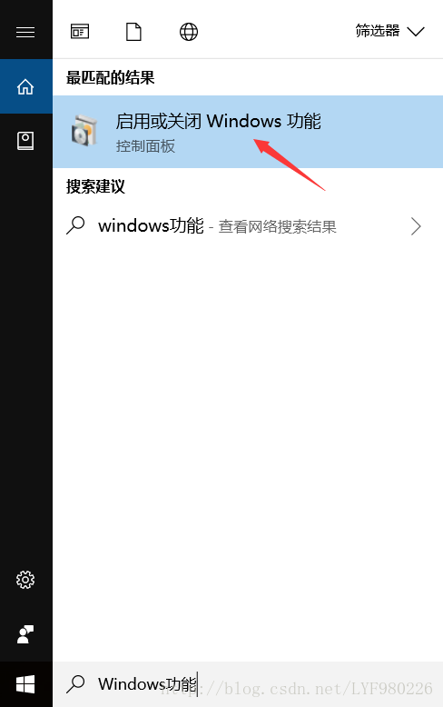

将Hyper-V勾选上后点击确定，然后重启计算机

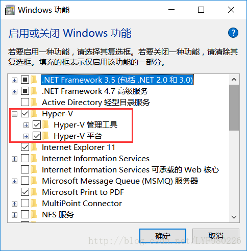

重启时间可能会稍微长一点，因为需要配置Windows功能
3. 在开始搜索框中搜索Hyper-V管理器点击打开 
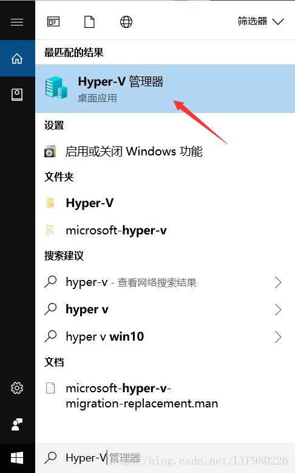

选择连接到服务器，再选择本地计算机，然后点击确定保存 
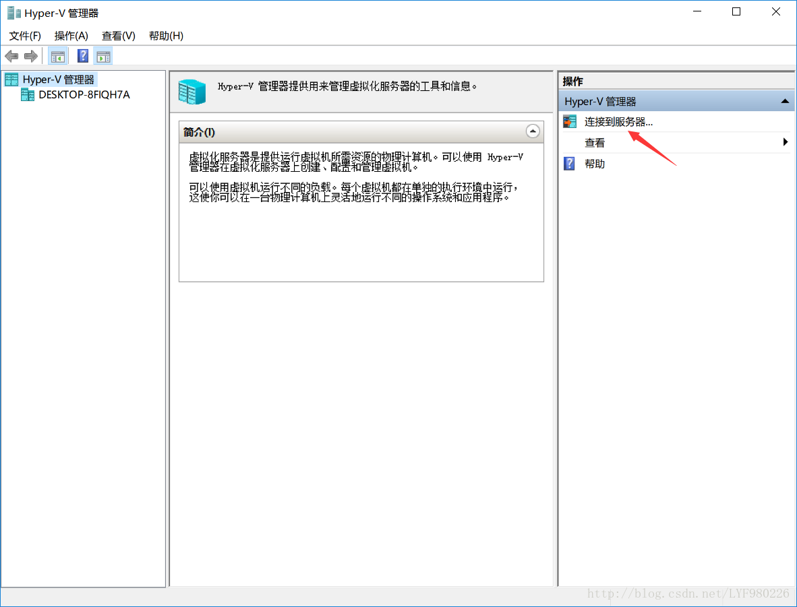

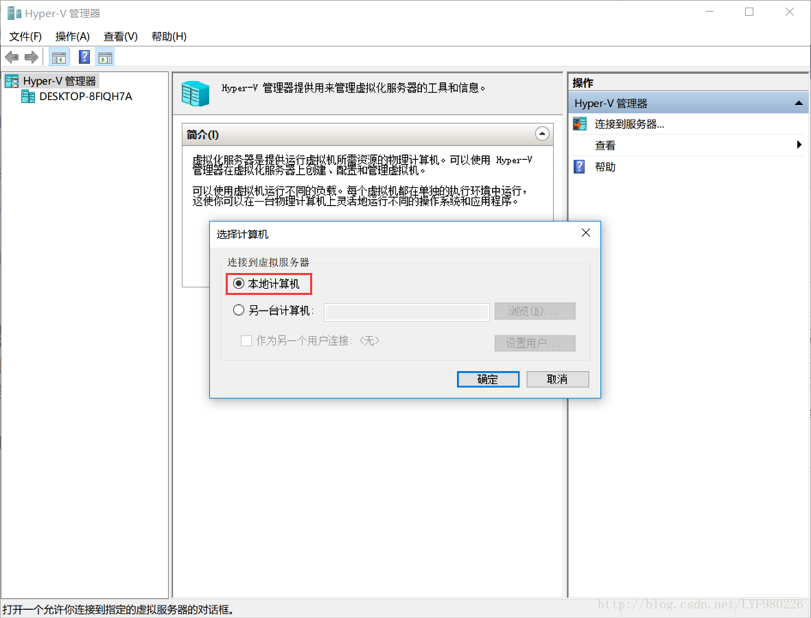

经过以上的配置，我们的虚拟环境就开启了

## 开发工具的安装 ##
Windows 10（专业版、企业版或教育版） 

Visual Studio 2017（安装时勾选上Win10 SDK的相关选项）

Unity5.5及以上版本

HoloLens模拟器

注：在安装Visual Studio和Hololens Emulator之前请确保已经配置好了虚拟环境，否则可能会出现VS Win10模拟器和Hololens模拟器安装报错的情况  
## 导出解决方案 ##
用Unity打开整个项目，点击File选择Build Settings，点击Add Open Scenes添加当前场景，在Platform中选择Universal Windows Platform然后点击Switch Platform切换平台，对右侧的选项进行如图所示的配置，然后点击Player Settings 
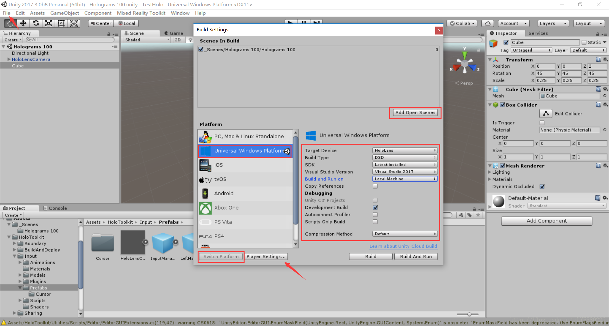

在XR Settings中开启Virtual Reality Supported并确保添加了Win10 SDK 
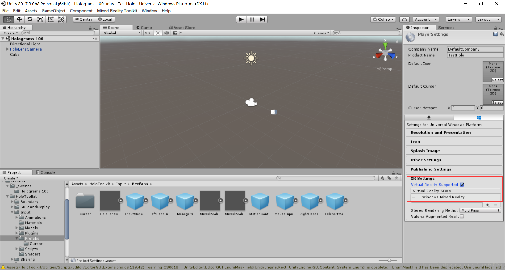

点击Edit选择Project Settings，再选择Quality，点击下拉框将UWP对应的等级设置为Ultra 
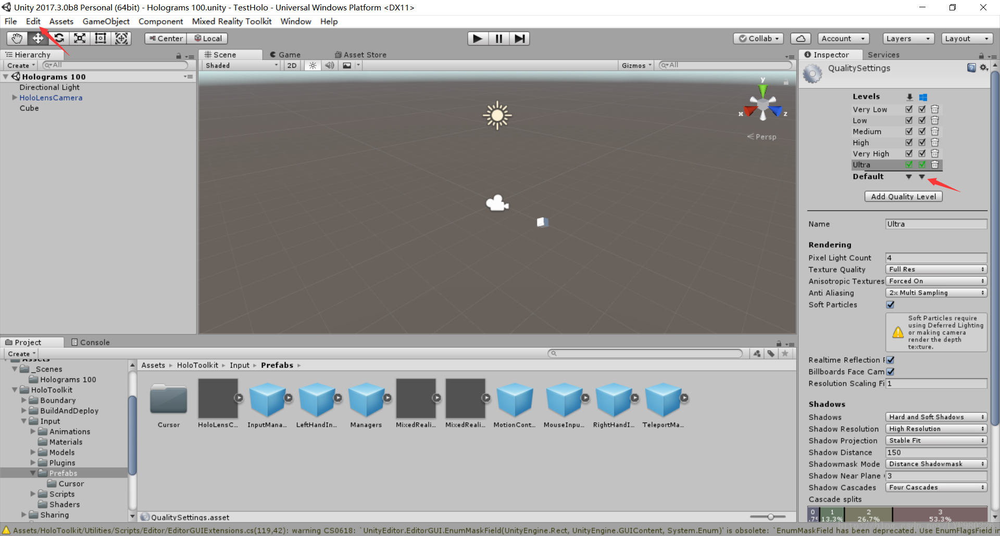

再次打开Build Settings点击Build，在项目目录下新建一个文件夹App，点击选择文件夹生成解决方案 
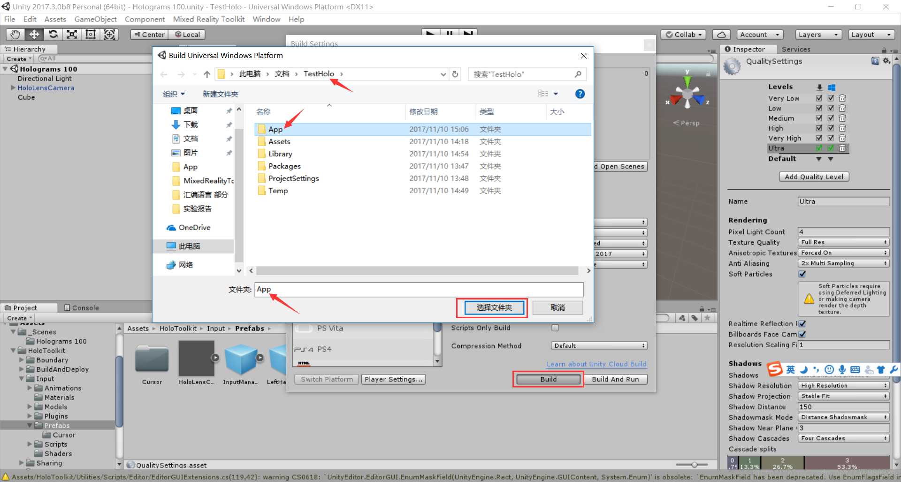

这样就成功的将项目导出为Visual Studio可运行的解决方案了
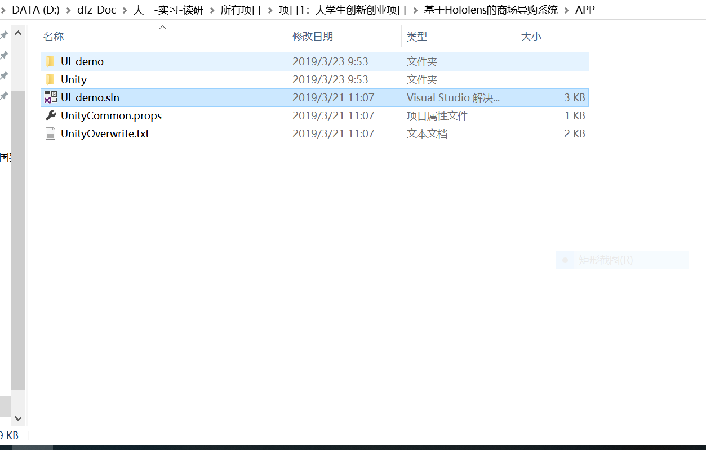

## 通过Visual Studio在Hololens Emulator上运行项目 ##

通过VS打开解决方案后进行如下配置，然后点击运行 
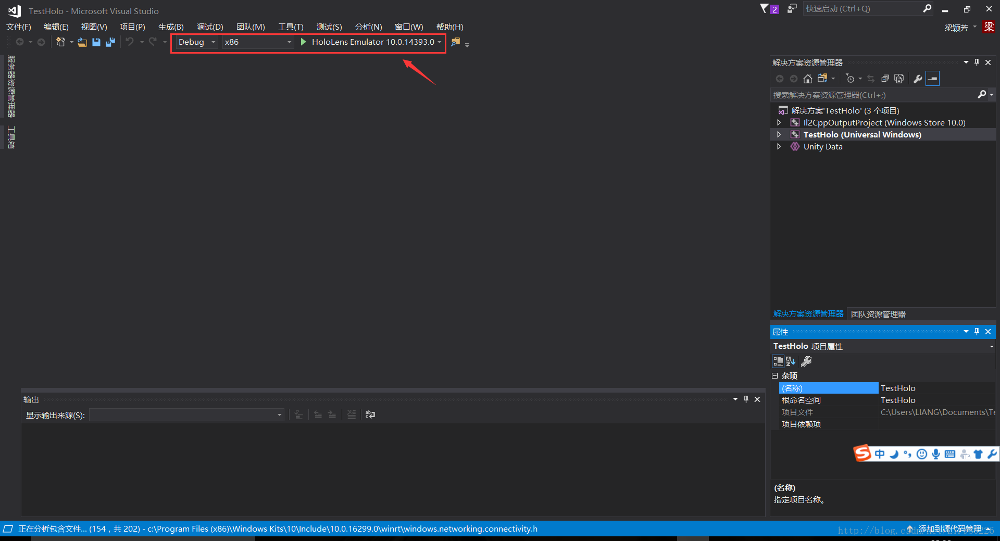

当模拟器中出现这个界面时，就说明项目可以在模拟器上成功运行了 
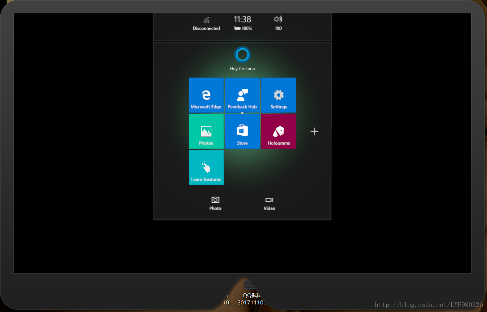

# 项目界面展示 #

启动界面
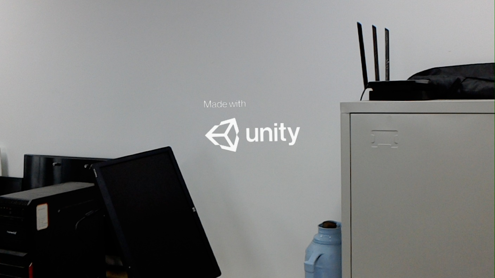

第一级主界面
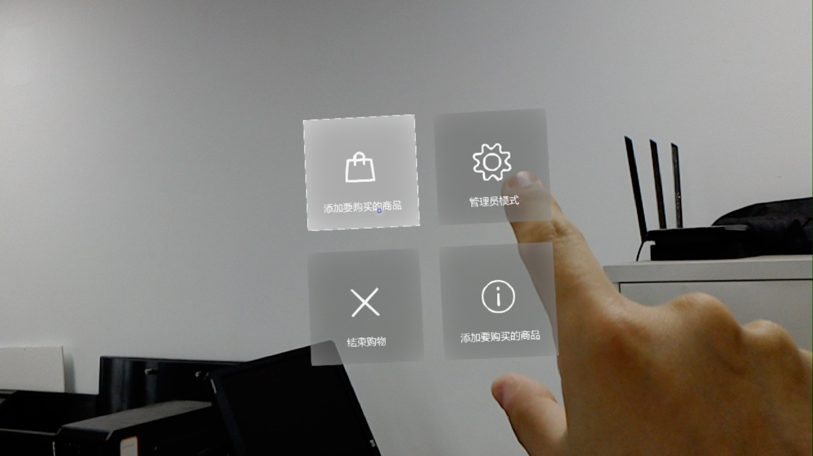

第二级主界面
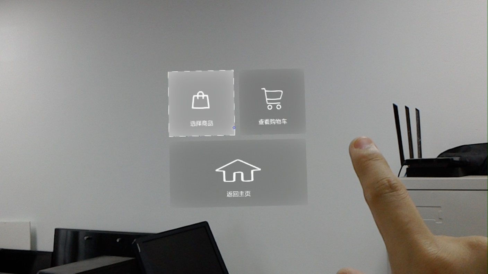

选择商品界面
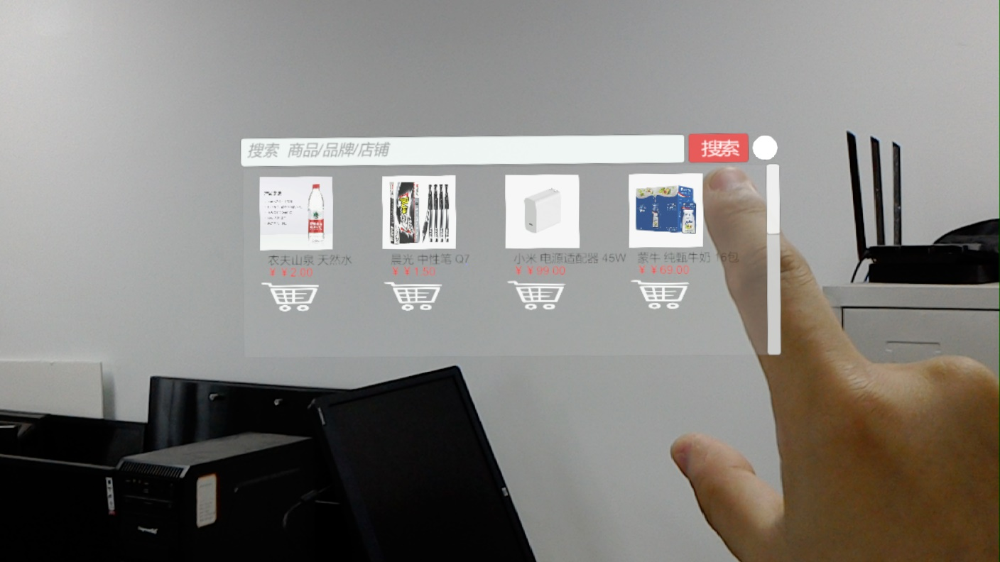

查看购物车界面
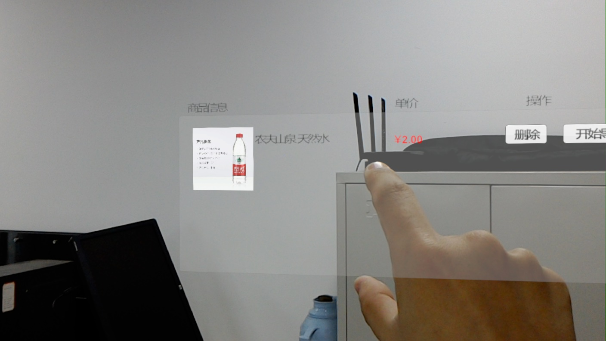

开始导航

导航开始

# 项目中的技术难点 #
1. 导航模块：使用HoloLens扫描场景，对场景模型进行优化，使用Unity的Navmash进行自动寻路，为顾客规划出从起点到目标点的最短路径。但是一开始没有考虑到起点和目标点不在同一平面的情况，最后通过学习相关文章，将三角网格模型表示为带权图结构，用Dijkstra算法计算两点间的最短路径，并将其作为三角网格模型上该两点间的最短路径的初始近似值，通过不断迭代对相关三角形边进行自适应细分，并构造每次细分后新的带权图，然后对网格模型上的两点间最短路径进行迭代逼近，最后求解出了近似最短路径
2. 扫描商品模块：预期是扫描商品条形码,但受HoloLens机能限制，最终用二维码代替，使用Qrcode对商品的二维码进行扫描，从而获取商品的详细信息

# 作者 #
段风志